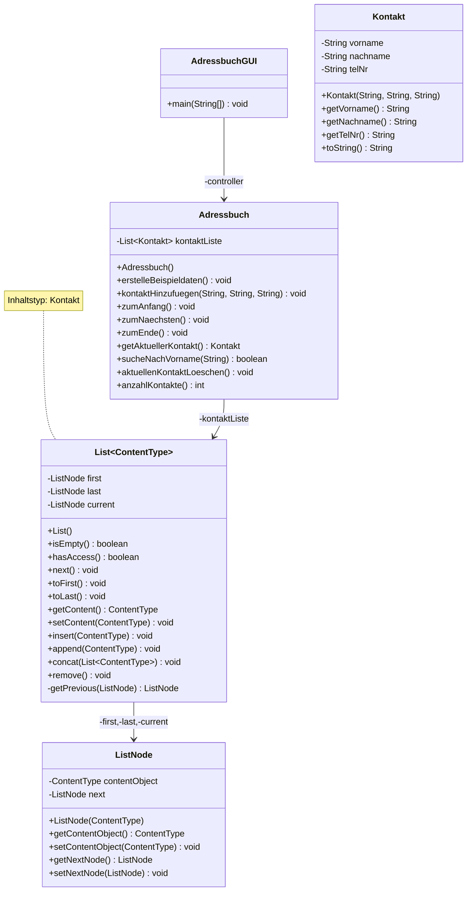

# Adressbuch-Programm zur Arbeit mit der linearen Datenstruktur Liste

```mermaid


classDiagram
    class Adressbuch {
        -List~Kontakt~ kontaktListe
        +Adressbuch()
        +erstelleBeispieldaten() void
        +kontaktHinzufuegen(String, String, String) void
        +zumAnfang() void
        +zumNaechsten() void
        +zumEnde() void
        +getAktuellerKontakt() Kontakt
        +sucheNachVorname(String) boolean
        +aktuellenKontaktLoeschen() void
        +anzahlKontakte() int
    }

    class AdressbuchGUI {
        +main(String[]) void
    }

    class Kontakt {
        -String vorname
        -String nachname
        -String telNr
        +Kontakt(String, String, String)
        +getVorname() String
        +getNachname() String
        +getTelNr() String
        +toString() String
    }

    class List~ContentType~ {
        -ListNode first
        -ListNode last
        -ListNode current
        +List()
        +isEmpty() boolean
        +hasAccess() boolean
        +next() void
        +toFirst() void
        +toLast() void
        +getContent() ContentType
        +setContent(ContentType) void
        +insert(ContentType) void
        +append(ContentType) void
        +concat(List~ContentType~) void
        +remove() void
        -getPrevious(ListNode) ListNode
    }

    class ListNode {
        -ContentType contentObject
        -ListNode next
        +ListNode(ContentType)
        +getContentObject() ContentType
        +setContentObject(ContentType) void
        +getNextNode() ListNode
        +setNextNode(ListNode) void
    }

    AdressbuchGUI --> Adressbuch : -controller
    Adressbuch --> List~Kontakt~ : -kontaktListe
    List~ContentType~ --> ListNode : -first,-last,-current

    note for List "Inhaltstyp: Kontakt"

```
